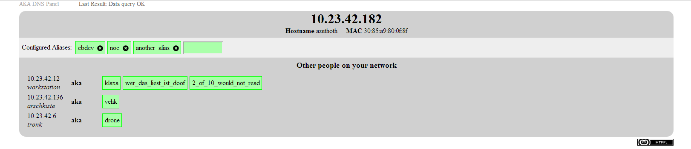
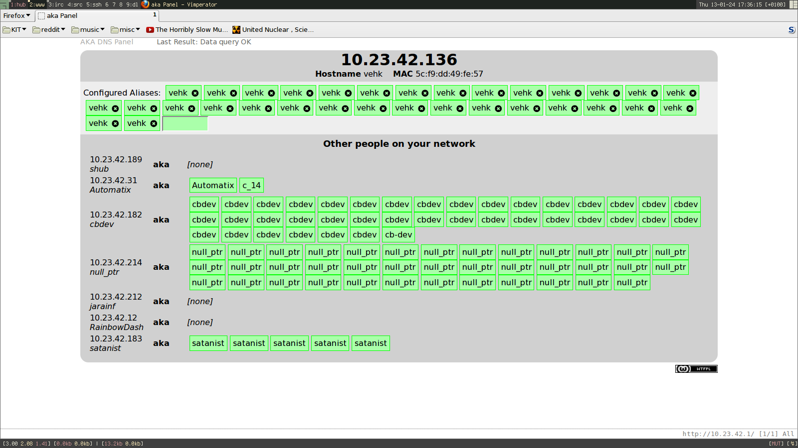

# akadns
A tiny web frontend used to create alias hostnames for LAN party members.
Works by rewriting a hosts-style alias file which is read by dnsmasq.
This mechanism is not really that stable, but it has been tested to work
with up to 20 clients constantly adding and deleting aliases.

The dnsmasq daemon must be constantly triggered to reload the file,
e.g. by sending the process a SIGHUP every 20 seconds.

## Screenshots

Working as intended 
 

Early bugfixing 
 
